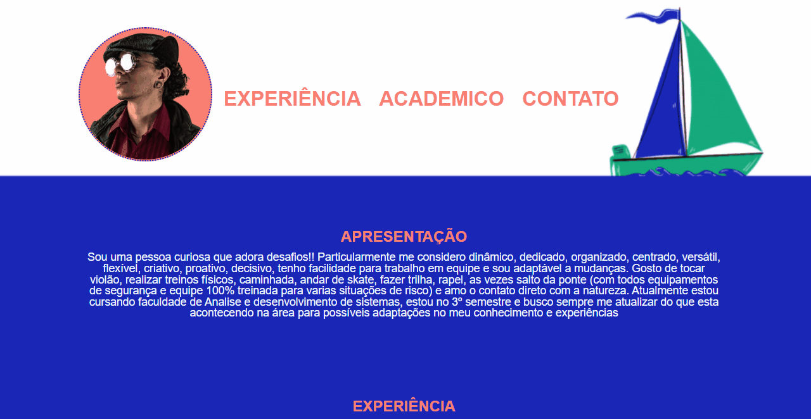
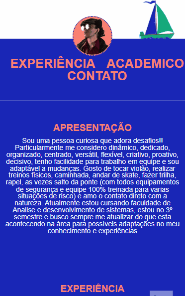

# Cartão de visita 💌

## 📝 Descrição

Aplicar meu conhecimento inicial em Html e CSS fazendo uma
landing-page responsiva para apresentar melhor quem eu sou de
forma mais autêntica e expressando o primeiro passo de minha
evolução na carreira de Frontend

## 📱Telinha
### Web:
[](https://brunoandradedinis.github.io/cartao-de-visita/)
### Mobile:
[](https://brunoandradedinis.github.io/cartao-de-visita/)
## 🔧 Tecnologias utilizadas
Através do VS Code finalizei o projeto com HTML e CSS.

## 👁‍🗨Funcionalidades do projeto
Dividido em 3 partes contendo as seguintes informações
- Cabeçalho contendo menu de navegação pela landingpage
	- Foto
	- Experiência
	- Academico
	- Contato
- Corpo principal contendo 3 divisões
	- Apresentação pessoal
	- Experiência com dados de empresas onde trabalhei
	- Formação acadêmica contendo dados das intituições onde cursei
- Rodapé
	- Icones de redes sociais para contato

## 🚀 Rodando o projeto

Clona aí pra analisar, é iniciante mas com atitude, pra rodar o projeto basta apenas clonar e executar o index.

```
git clone https://github.com/BrunoAndradeDinis/cartao-de-visita.git
```

Só abrir o index que é sucesso!

## 🎯 Status do projeto
 ✅Concluído!
